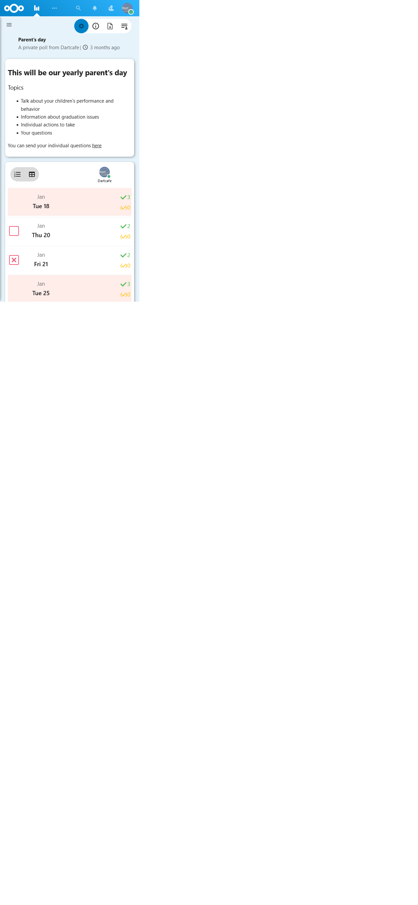
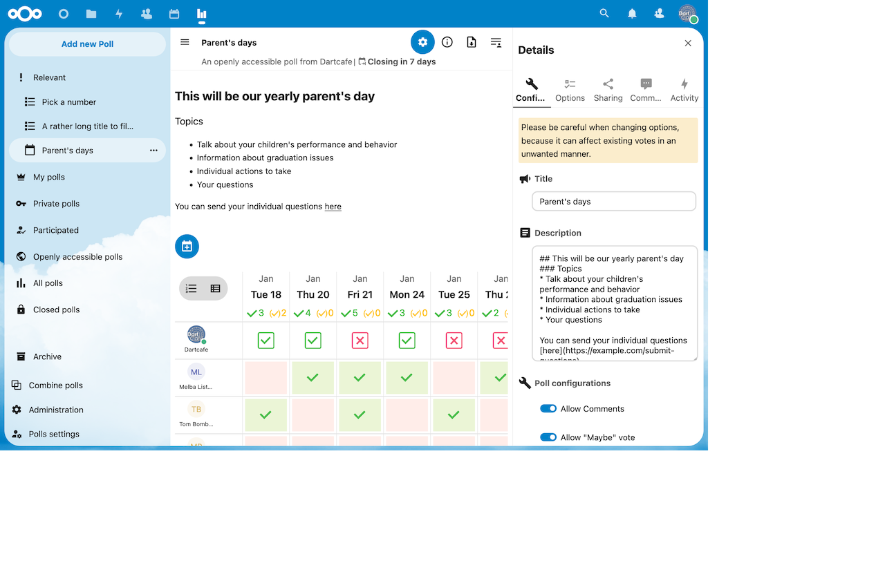
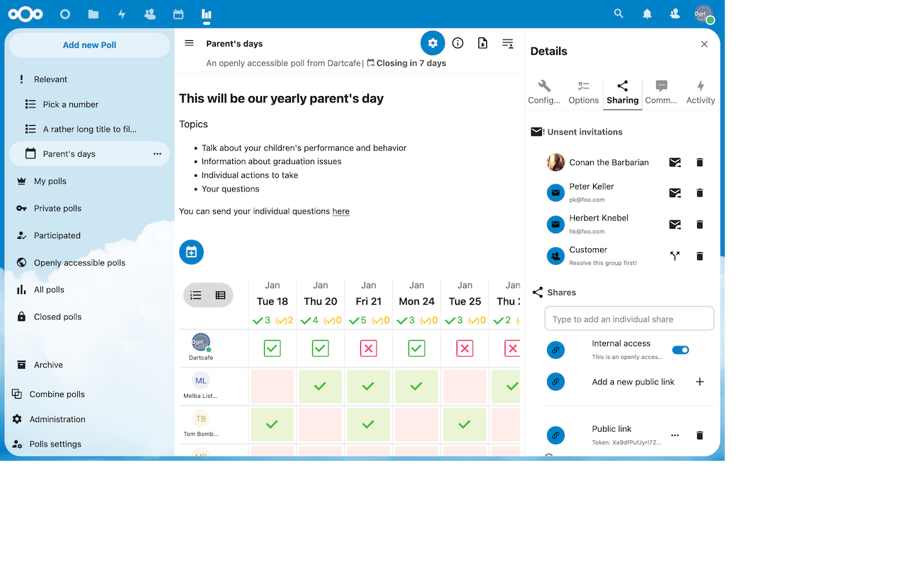
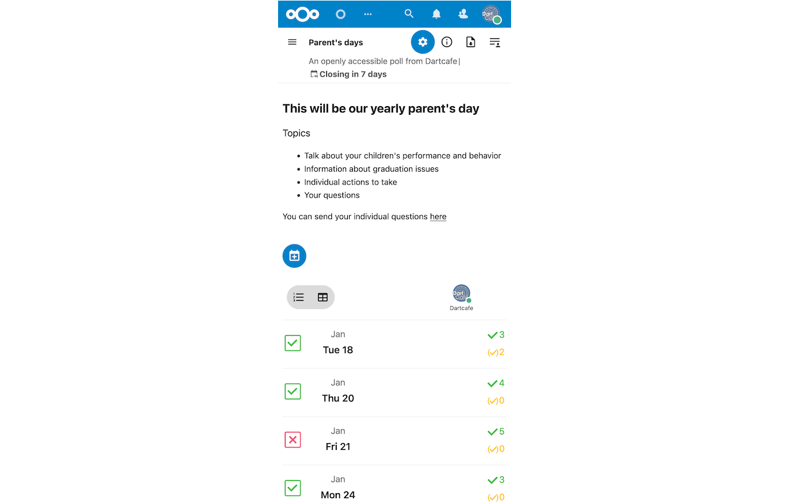

<!--
  - SPDX-FileCopyrightText: 2016 Nextcloud contributors
  - SPDX-License-Identifier: AGPL-3.0-or-later
-->
# Polls - an app, similar to doodle or DuD-Poll, for Nextcloud written in PHP and JS/Vue.

# Free meeting schedule tool
- :next_track_button: Easy poll creation
- :hammer_and_wrench: Highly customizable
    - :envelope: Make your poll confidential by hiding the results until you want them to be discovered
    - :dark_sunglasses: Obfuscate participants' names from other participants or set strong anonymous mode
    - :timer_clock: Set an automatic expiry date
    - :heavy_plus_sign: Allow participants to add more options
    - :white_check_mark: Limit votes per option or user
    - ... :currency_exchange: and a lot more
- :mailbox_with_mail: Invite everyone you want
- :rocket: Export your poll to different spreadsheet formats or HTML
- :red_envelope: Let Polls automatically remind your invited users
- :speech_balloon: Comments
- :ballot_box_with_check: Confirm options after poll closing
- :loudspeaker: Subscribe to notifications per poll
- :date: Get hints about possible conflicting entries in your calendar around the date option
- :toolbox: Usable via REST-API
- Supports the following nextcloud apps
    - Circles
    - Contacts
    - Activity

Find Polls in the [Nextcloud app store](https://apps.nextcloud.com/apps/polls).

## Commercial break and thank you
Thank you guys, who support this app over the years by reporting issues, ideas and even helping analyzing difficult situations. This app can only be maintained with your help and with your proven patience. This is the biggest value the app could get over the last years since I took over the maintenance of Polls.

Out of reasons, I am adding another way to support me directly by [spending me a :coffee:](https://buymeacoffee.com/dartcafe). But please, only do that if you can really afford it and have an advantage by using this app.

:notes: Commercial jingle fading off :musical_note:

For clarification: Polls is not maintained by Nextcloud, although it resides unter the Nextcloud organisation here on Github.

## Installation / Update
See [wiki](https://github.com/nextcloud/polls/wiki/Installation-help).

## Available occ commands
See [wiki](https://github.com/nextcloud/polls/wiki/OCC-commands).

## Support
- Report a bug or request a feature:  https://github.com/nextcloud/polls/issues
- Community support: https://help.nextcloud.com/c/apps/polls/

## Screenshots
Manage your polls and create new ones | Many configuration options | Share your poll with other people | Vote on mobile
:-:|:-:|:-:|:-:
 |  |  | 

### Installation help
See [wiki](https://github.com/nextcloud/polls/wiki/Installation-help).

## Contribution Guidelines
Please read the [Code of Conduct](https://nextcloud.com/community/code-of-conduct/). This document offers some guidance to ensure Nextcloud participants can cooperate effectively in a positive and inspiring atmosphere, and to explain how together we can strengthen and support each other.

For more information please review the [guidelines for contributing](https://github.com/nextcloud/server/blob/master/.github/CONTRIBUTING.md) to this repository.
