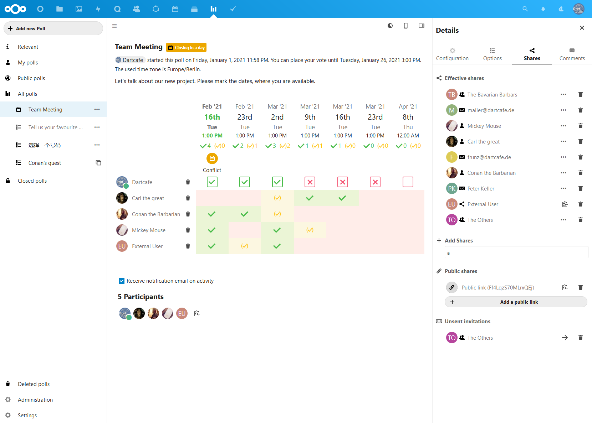
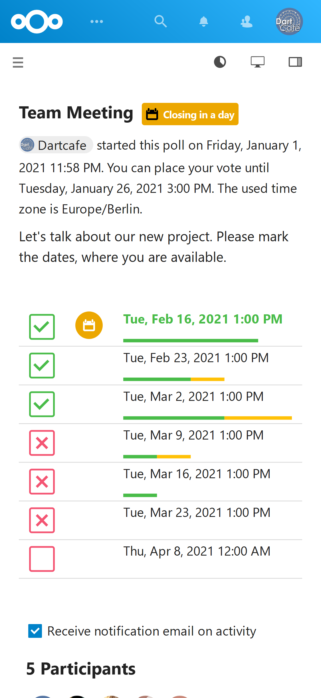

# Polls

[](LICENSE)

This is a poll app, similar to doodle or dudle, for Nextcloud written in PHP and JS / Vue.

## Features
- :bar_chart: Create / edit polls (datetimes and texts)
- :date: Set a closing date
- :lock: Restrict access (all site users or invited users only)
- :speech_balloon: Comments
- Share poll with users, groups, contacts and circles
- Invite external users with a unique link or via email address
- Hide results permanently or until the poll is closed
- Confirm options after poll closing
- Create anonymized polls (participants names get pseudonymized for other users)
- Limit possible answers per option and per user
- Subscribe to notifications
- Get hints about possible conflicting entries in your calendar around the date option
- Switch between list and table view
- Configure your preferred view for date and text polls

## Bugs
- https://github.com/nextcloud/polls/issues

## Screenshots (table view)
Create a new poll from the navigation bar and get an overview of your polls


#### Vote and comment (list view)


#### Edit poll inside the vote page


#### Add shared links to your poll


#### View the vote page on mobiles


## Installation / Update
This app is supposed to work on Nextcloud version 19+.

### Install latest release
You can download and install the latest release from the [Nextcloud app store](https://apps.nextcloud.com/apps/polls).

### Install from git
If you want to run the latest development version from git source, you need to clone the repo to your apps folder:

```
git clone https://github.com/nextcloud/polls.git
```

* Install dev environment with ```make dev-setup```
* Compile polls.js with ```npm run build```
* Run a complete build with ```make all``` (installs dev env, runs linter and builds the polls.js)

## Contribution Guidelines
Please read the [Code of Conduct](https://nextcloud.com/community/code-of-conduct/). This document offers some guidance
to ensure Nextcloud participants can cooperate effectively in a positive and inspiring atmosphere, and to explain how together
we can strengthen and support each other.

For more information please review the [guidelines for contributing](https://github.com/nextcloud/server/blob/master/.github/CONTRIBUTING.md) to this repository.
