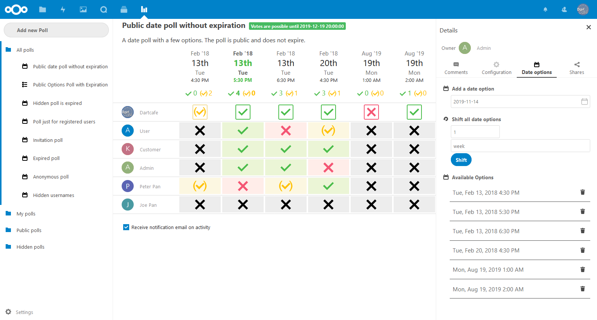
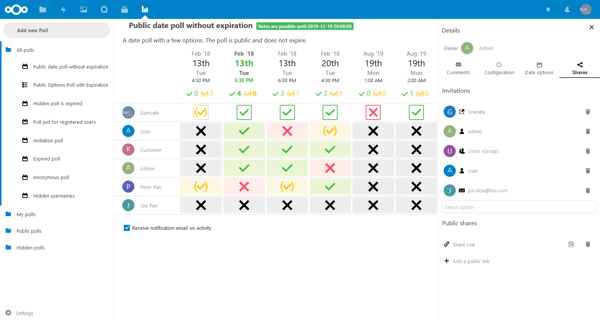
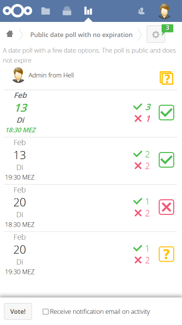
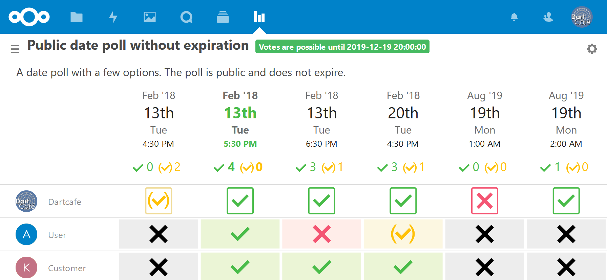

# Polls

[](https://travis-ci.org/nextcloud/polls)
[](https://scrutinizer-ci.com/g/nextcloud/polls)
[](https://scrutinizer-ci.com/g/nextcloud/polls)
[](LICENSE)

## This branch is in alpha state, do not use for production needs

This is a poll app, similar to doodle or dudle, for Nextcloud written in PHP and JS / Vue.
It is a rework of the already existing [polls app](https://github.com/raduvatav/polls) written by @raduvatav.

**Note**: ownCloud is **no longer** supported! Last (confirmed) working version is 0.8.1 and is released in the oC marketplace.
**Note**: IE11 users will face some CSS problems (see #541). Please change to a compatible browser (Firefox, Chrome, Edge, etc.). Or better: don't even try this browser

### Features
- :bar_chart: Create / edit polls (datetimes _and_ texts)
- :date: Set expiration date
- :lock: Restrict access (only logged in users, certain groups / users, hidden and public)
- :speech_balloon: Comments

### Bugs
- https://github.com/nextcloud/polls/issues

### Screenshots
Create a new poll from the navigation bar and get an overview of your polls


Vote and comment


Edit poll on the vote page as owner or an admin



Add shared links to your poll


View the vote page on mobiles


Turn phone to landscape to see details


## Installation / Update
This app is supposed to work on Nextcloud version 13+.

### Install latest release
You can download and install the latest release from the [Nextcloud app store](https://apps.nextcloud.com/apps/polls).

### Install from git
If you want to run the latest development version from git source, you need to clone the repo to your apps folder:

```
git clone https://github.com/nextcloud/polls.git
```

* Install dev environment with ```make dev-setup```
* Compile polls.js with ```make build-js-production``` or ```npm run build```
* Run a complete build with ```make all``` (installs dev env, runs linter and builds the polls.js)

## Contribution Guidelines
Please read the [Code of Conduct](https://nextcloud.com/community/code-of-conduct/). This document offers some guidance
to ensure Nextcloud participants can cooperate effectively in a positive and inspiring atmosphere, and to explain how together
we can strengthen and support each other.

For more information please review the [guidelines for contributing](https://github.com/nextcloud/server/blob/master/CONTRIBUTING.md) to this repository.
